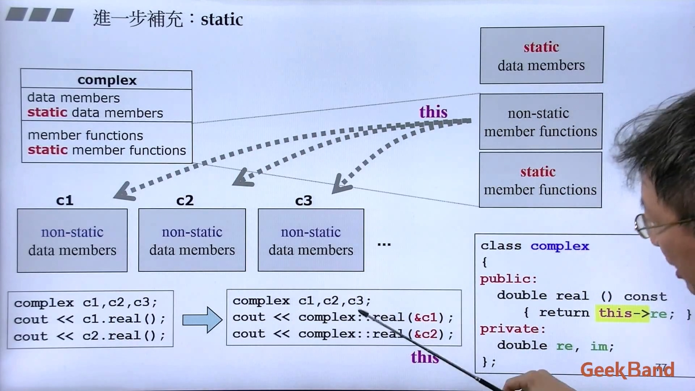
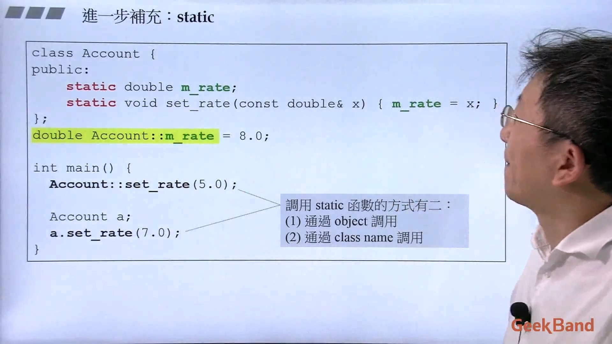
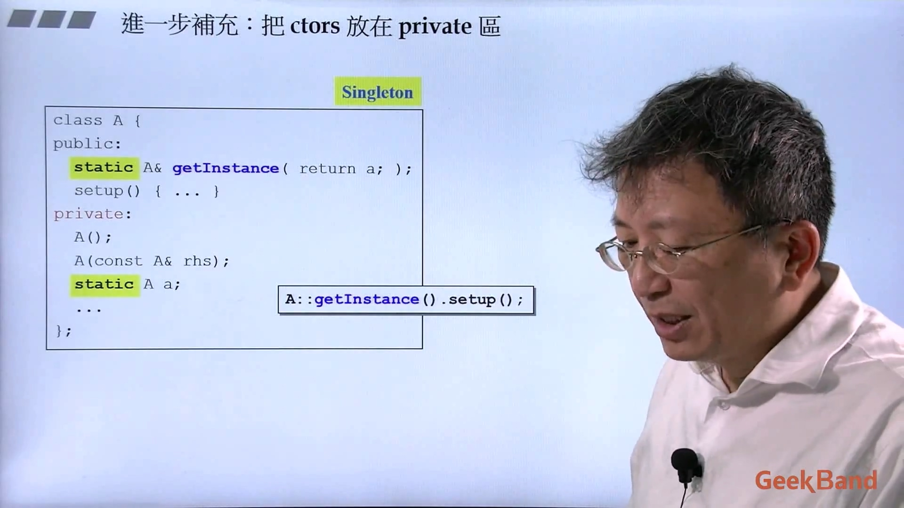
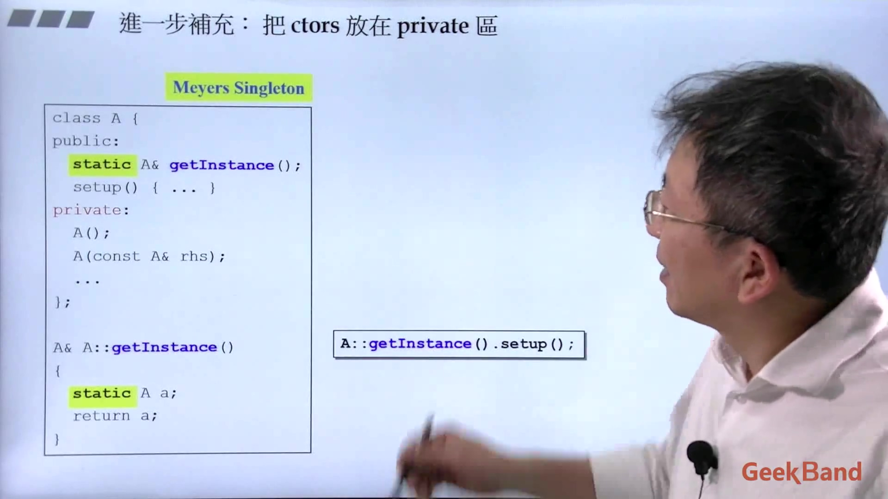
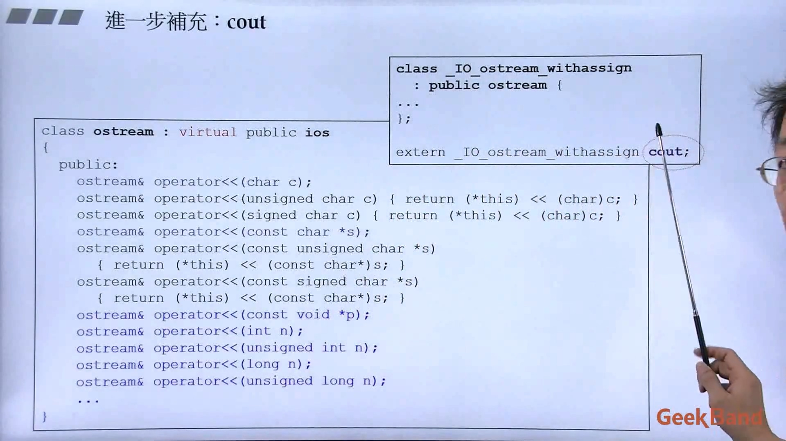
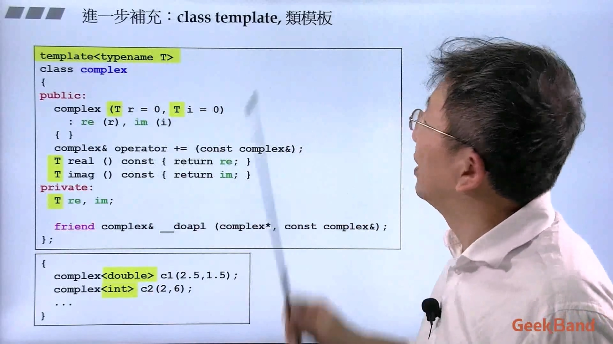
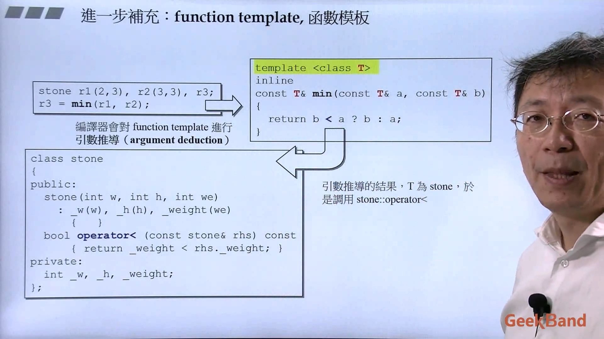
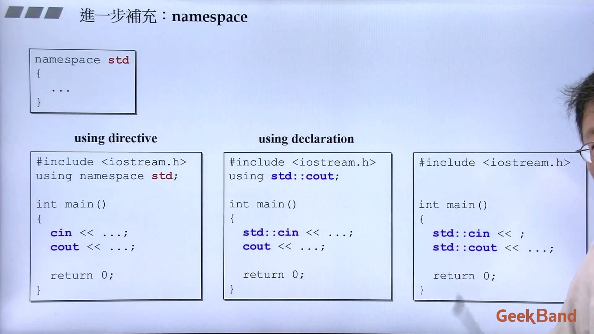
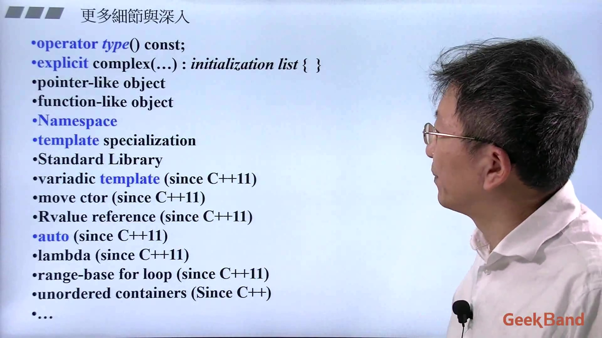

## 1. 进一步补充：static
成员变量每个对象都有一份，成员函数同个类的不同对象共用一个。

Singleton

Meyers Singleton

  
## 2. 进一步补充：cout
这里重载了很多。

  
## 3. 进一步补充：模板
编译器看到下面的 double 后会把 T 全部替换为 double ，同样编译器看到下面的 int 后会把 T 全部替换为 int 。

 < 交给类来实现，所以函数模板的设计很合理。

  
## 4. 进一步补充：namespace

  
## 5. 更多细节
未来还有更多需要学习。

