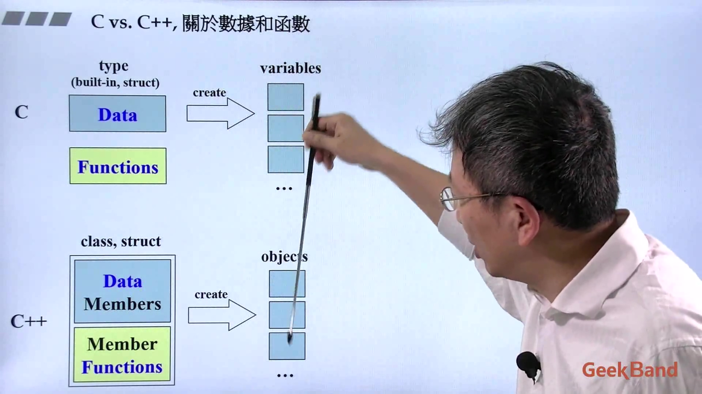
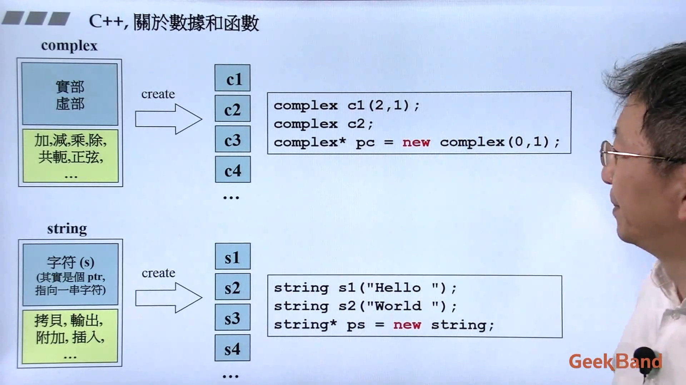
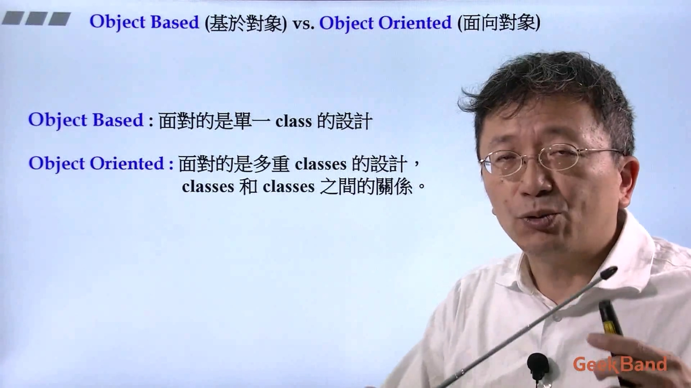
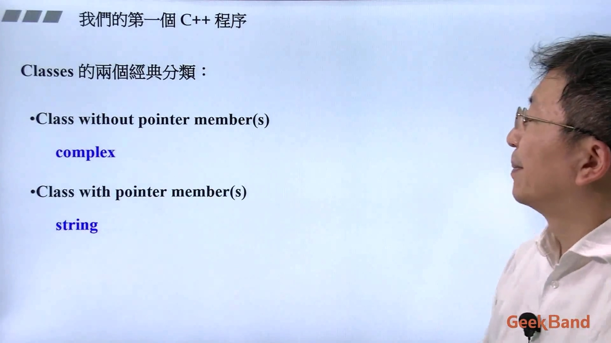
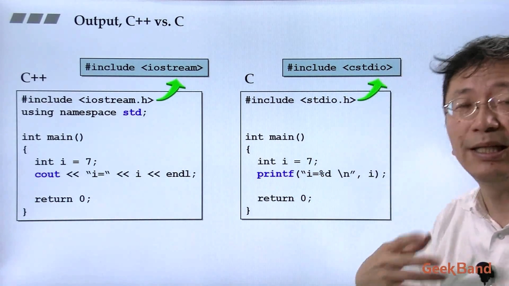
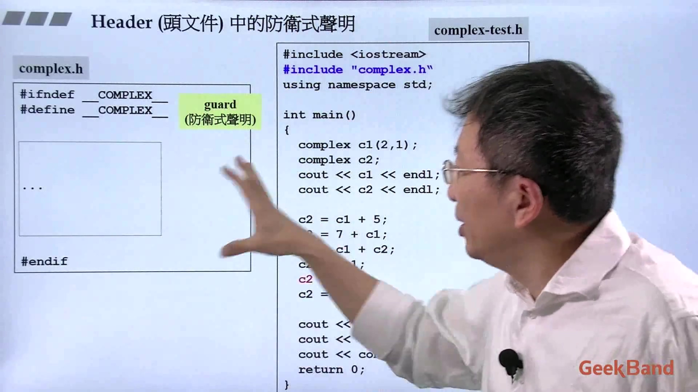
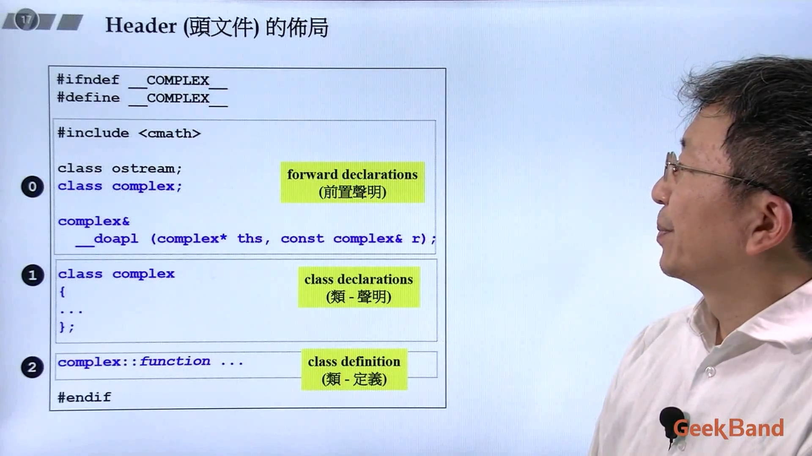
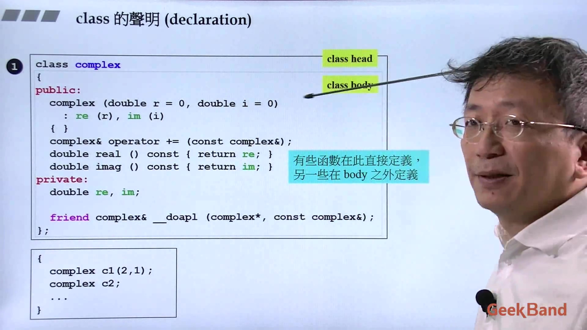
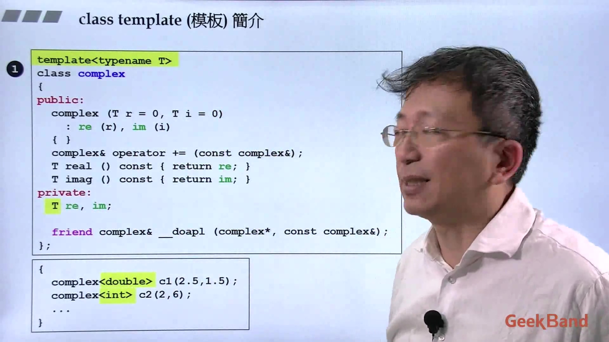

1. 数据和函数
    封装的概念  
    
    数据可以有很多份，但函数只有一份； string类 是带指针的类，每个数据里只有一个指针  
    
  
2. 基于对象和面向对象的概念
    基于对象：面对的是单一class的设计
    面向对象：面对的是多重classes的设计，classes和classes之间的关系
    
  
3. 类的两个经典分类
    类分为没有指针的和有指针的，没有指针的用 complex类 举例，有指针的用 string类举例  
    
  
4. 头文件编写
    C++输出直接“丢”就行，C语言要说明我“丢”的东西是什么格式的。
    
    类的防卫式声明
    
    
    写类之前要思考类需要什么data，需要什么函数
    
    这里介绍下模板，后面是举的例子是没有模板的
    

