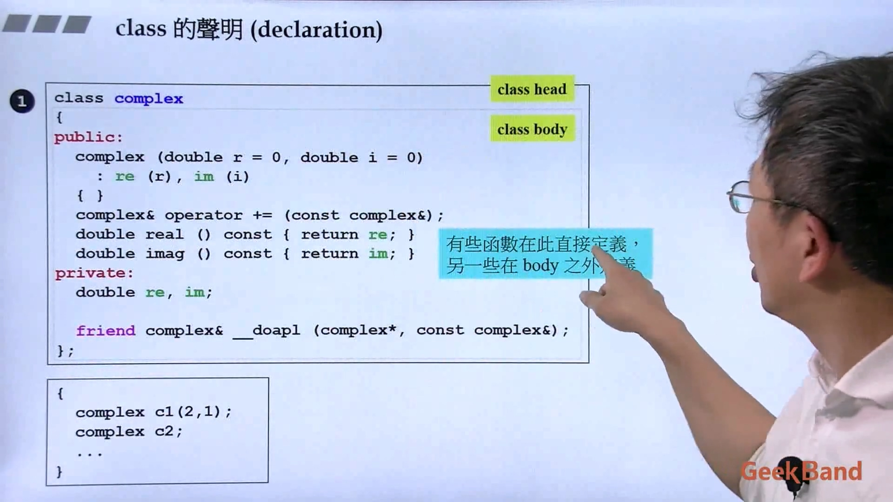
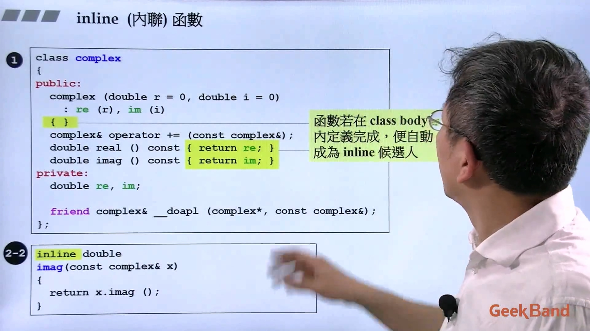
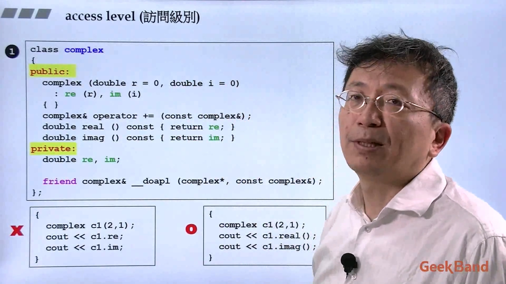
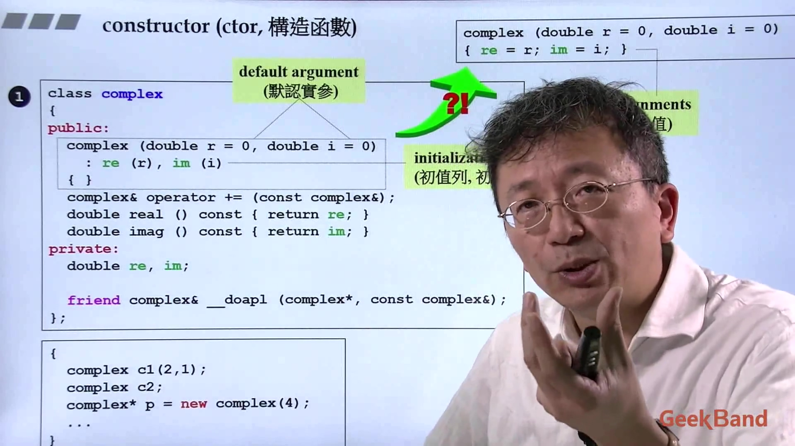
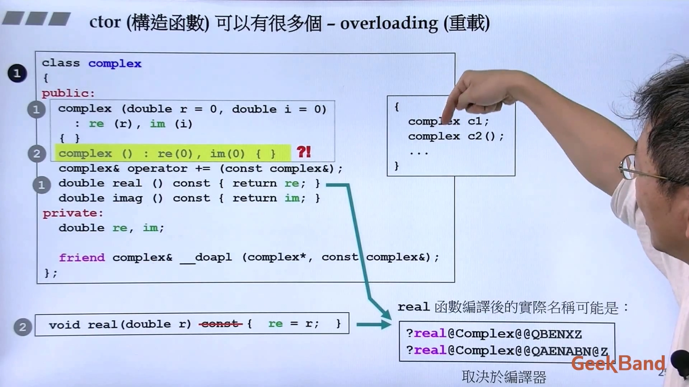

## 1. 类的声明、内联函数与访问级别
函数在类的内部定义，就直接是内联（inline）函数；在类外定义就不是内联。但是，是否可以真的成为内联，由编译器决定。

数据一般设为private，通过对象不能直接取private的数据，一般通过函数获取。

  
## 2. 构造函数
这里的构造函数有默认实参；使用了初值列表；构造函数是没有返回类型。写成右上角那样也是可以的，但是效率会差一些，构造函数会先执行初值列表，再执行大括号内的内容。

不带指针的类多半不用自己写析构函数。