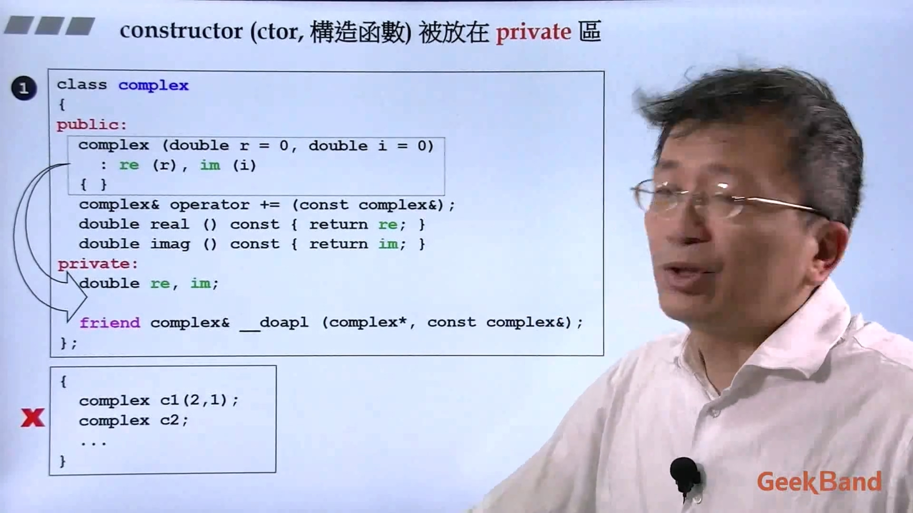
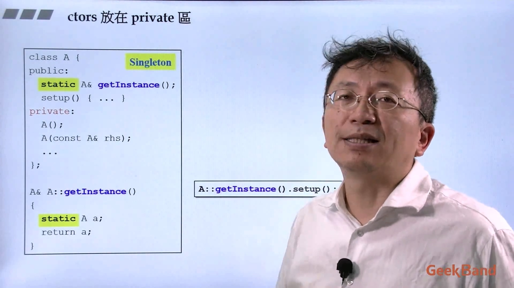
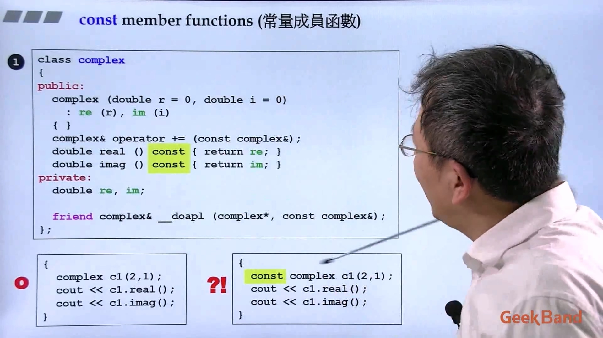
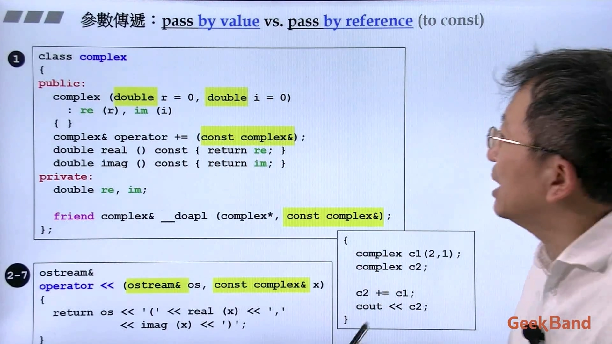
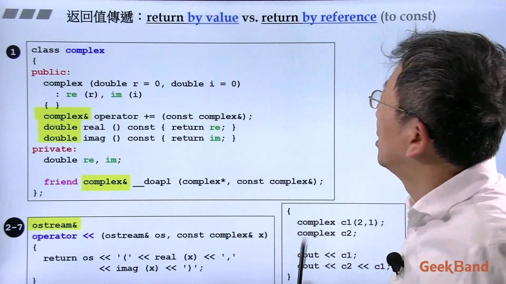
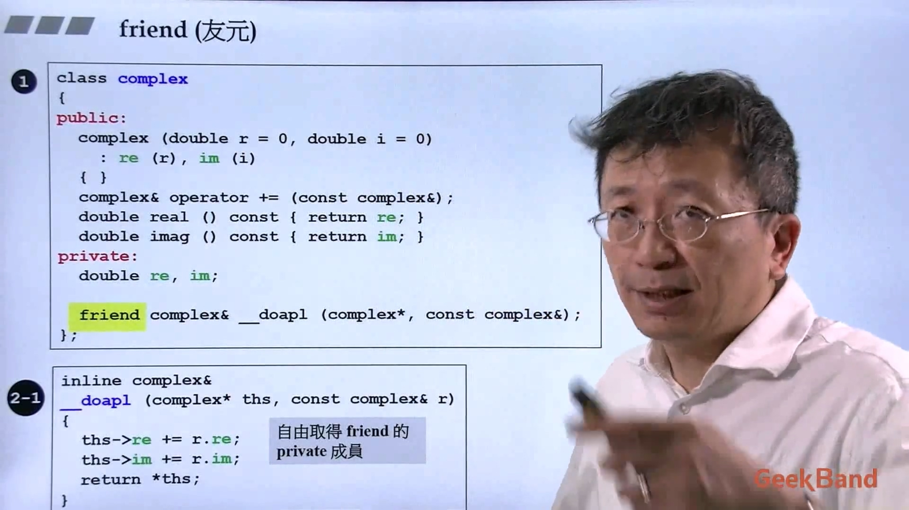
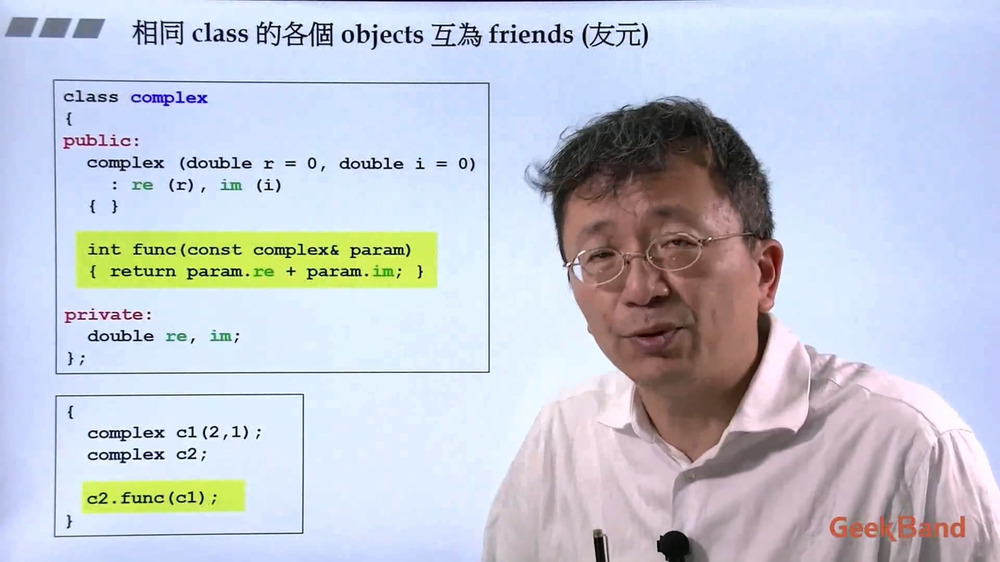

## 1. 构造函数放在private里
构造函数如果放到private里，外界就不能直接创造对象。  

单例模式（singleton）就是把构造函数放在private的。  

  
## 2. 成员函数
常量成员函数。对于成员函数，分为会改变成员变量和不会改变成员变量的两种。对于不会改变成员变量的，需要加上const。下面const类的对象只能使用带const的成员函数。  

参数传递尽量都用引用，如果要细致一些，占用内存小的可以用值传递。参数传递可以加const的都加const。  

返回值传递用值传递还是引用传递。一般来说可以用引用传递就用引用传递，临时变量用值传递。  

  
## 3. 友元函数
友元是一种允许非类的成员函数访问类的非公有成员的一种机制。友元函数在类的作用域外定义，但需要在类体中加上关键字friend进行说明。友元函数可以访问类中的所有成员，不受 public private protected 的限制，而且友元函数写在类中的哪个区域都一样。友元函数破坏了类的封装性，尽量少用。  

