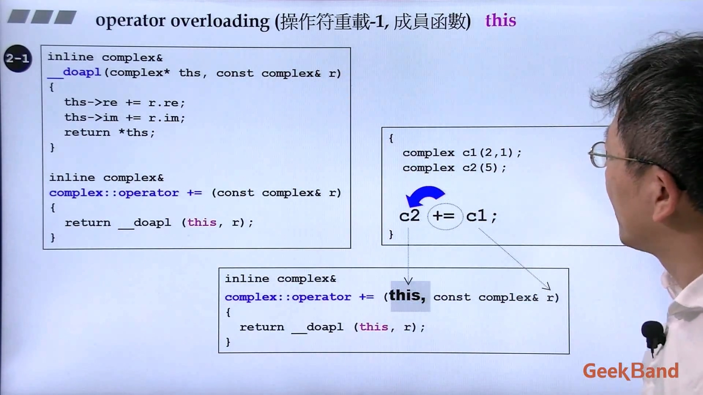
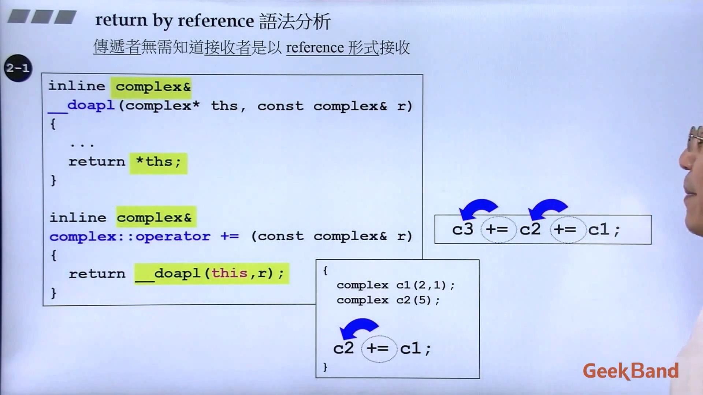
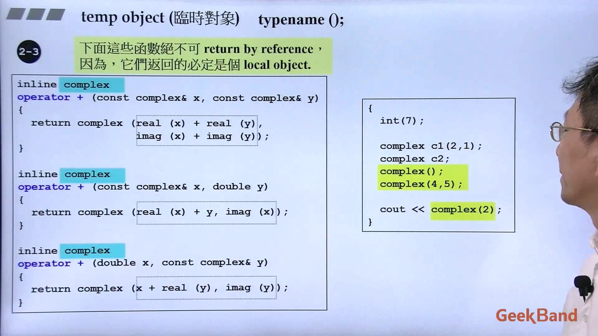
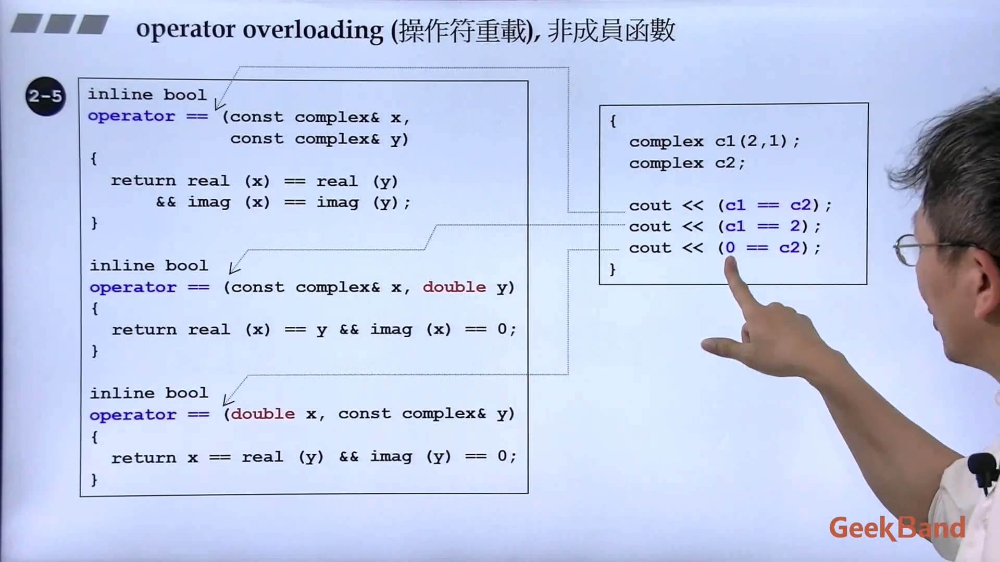
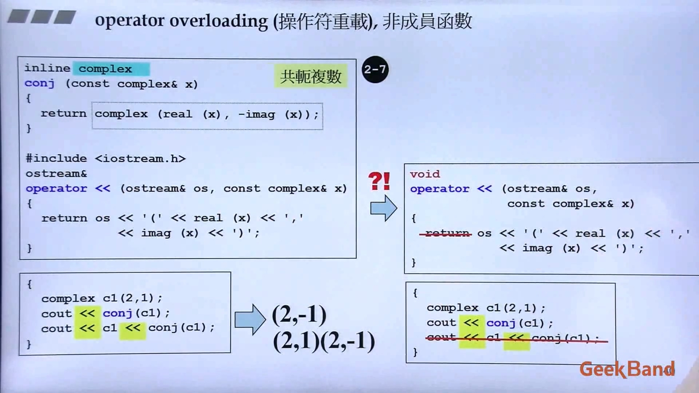

## 1. 要重载的操作符

  
## 2. 以成员函数的形式重载
对于右边作用于左边的操作符用成员函数  

要连续 += ，返回值需要用引用传递。

  
## 3. 以非成员函数的形式重载
非成员函数（全局函数，友元函数）

这里是局部对象，不能用引用返回

这里要连 << ，得返回引用。

  
关于用成员函数还是非成员函数，老师简单提了一下，具体可以参考以下链接：[到底以成员函数还是全局函数（友元函数）的形式重载运算符](https://zhuanlan.zhihu.com/p/627744466)。