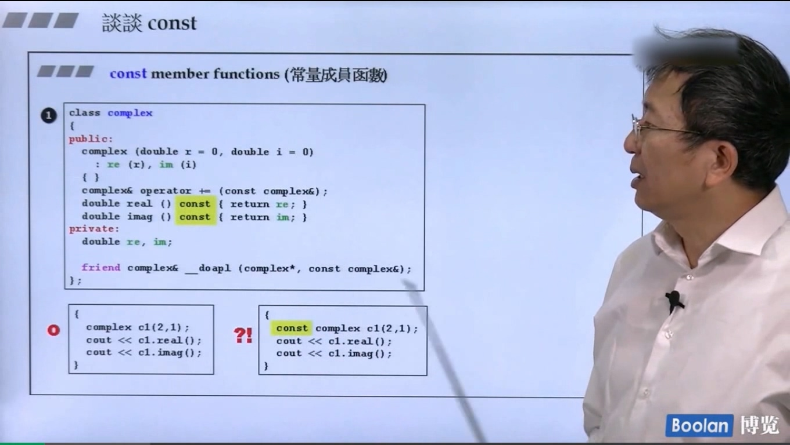
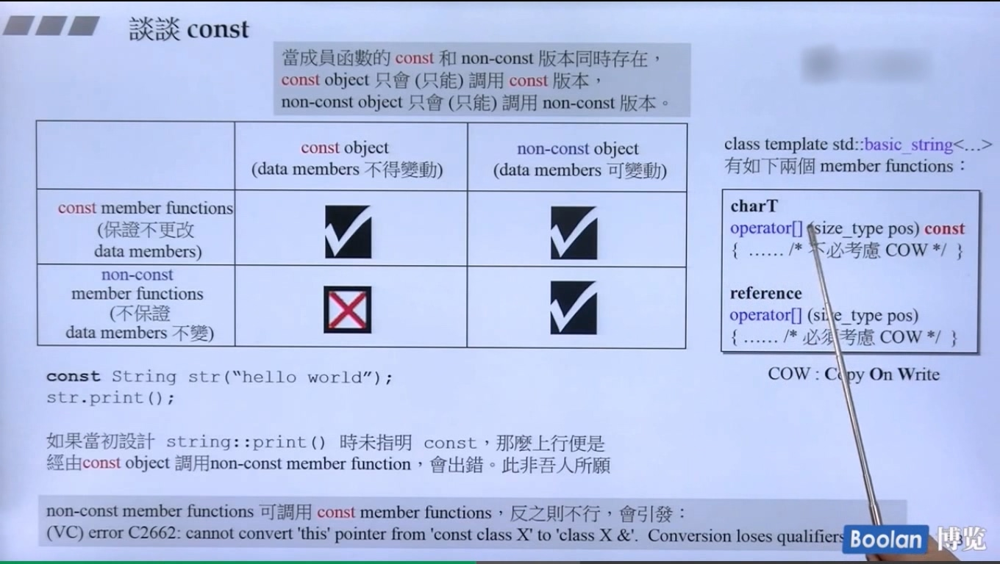

当成员函数的 const 和 non-const 版本同时存在，const object 只能调用 const 版本，non-const object 只能调用 non-const 版本。这里举了常量字符串和非常量字符串的例子，常量字符串只能调用 const 版本的 operator[] () 。
而更一般的情况， const object 只能调用 const member functions ，non-const object 两种成员函数都可以调用。
