malloc() 申请内存会附带申请好多其他的内存，申请小内存就会比较浪费。
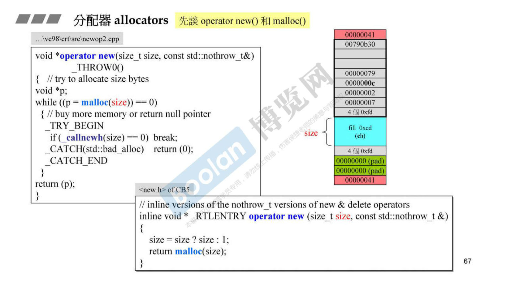
VC6、BC5 所附标准库的 allocator 类，底层调用的都是 new ，而 new 调用的是 malloc() 。
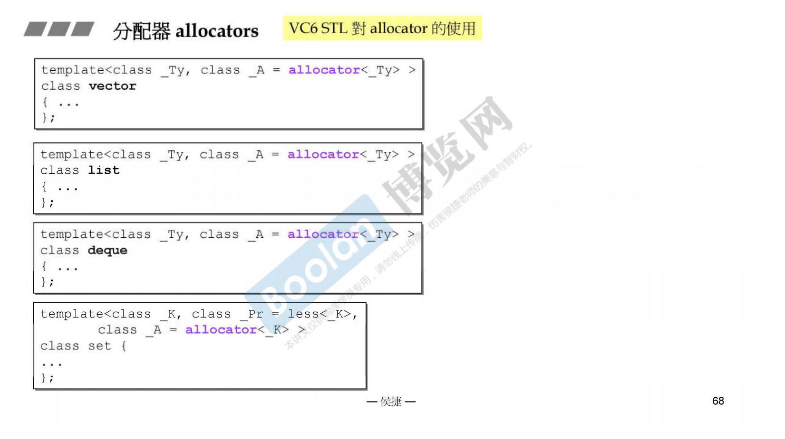
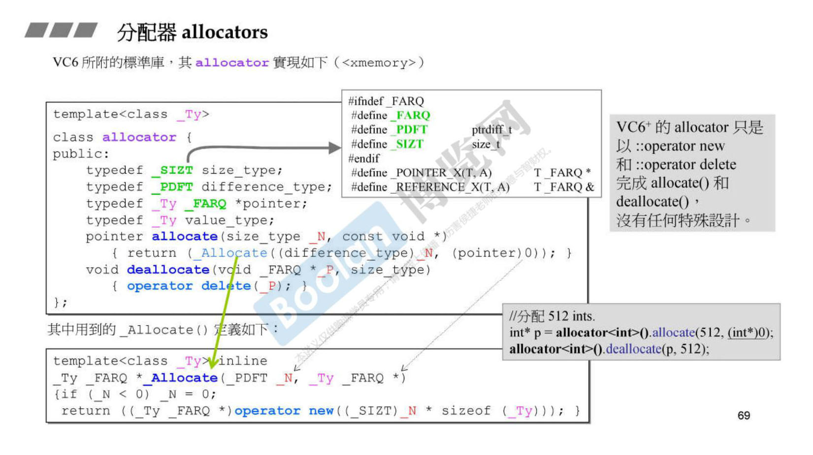
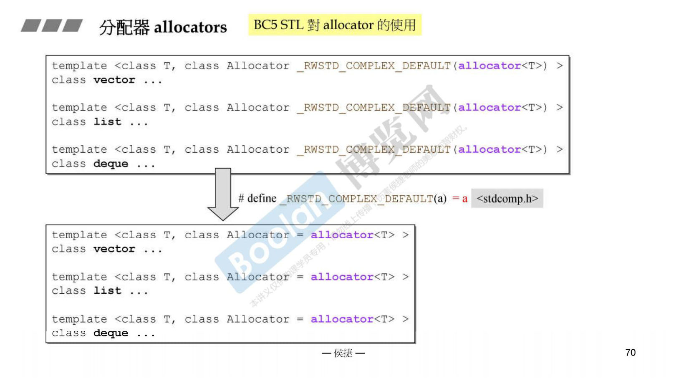
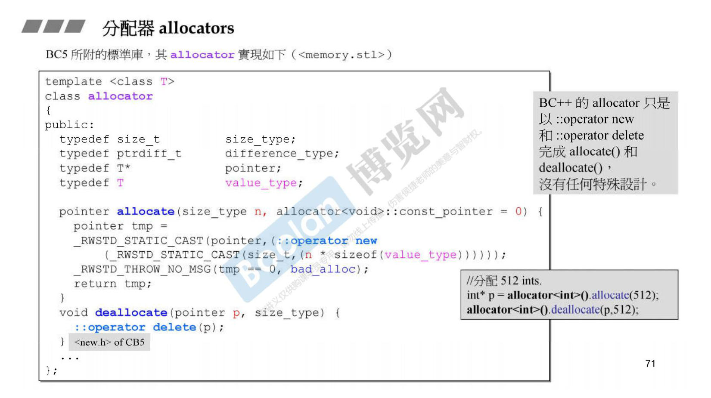
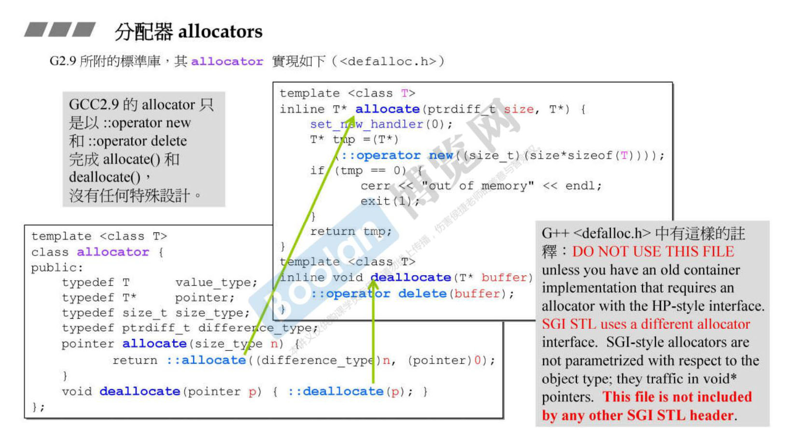
G2.9 STL 的 allocator 使用的是内存池。
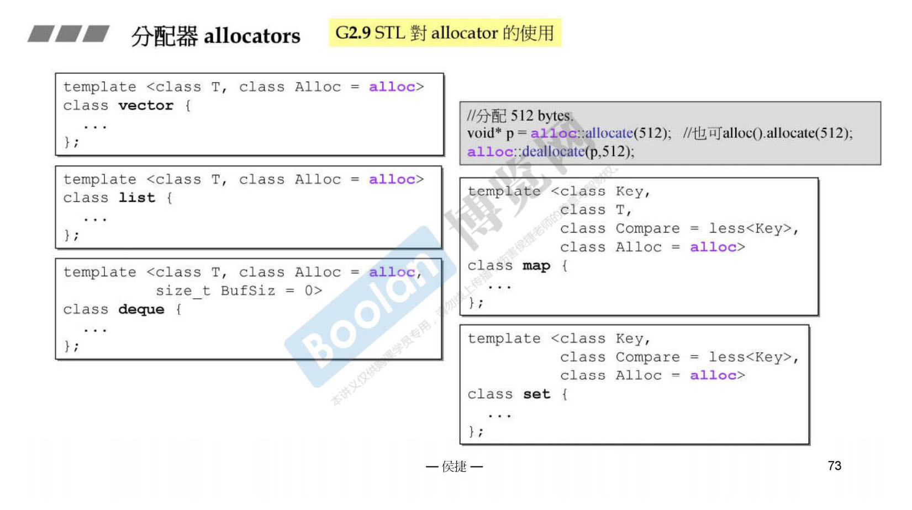
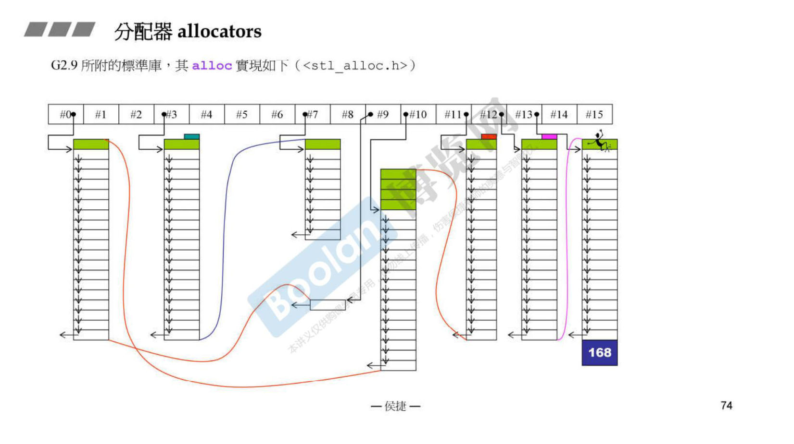
G4.9 STL 的 allocator 使用的是 new 。
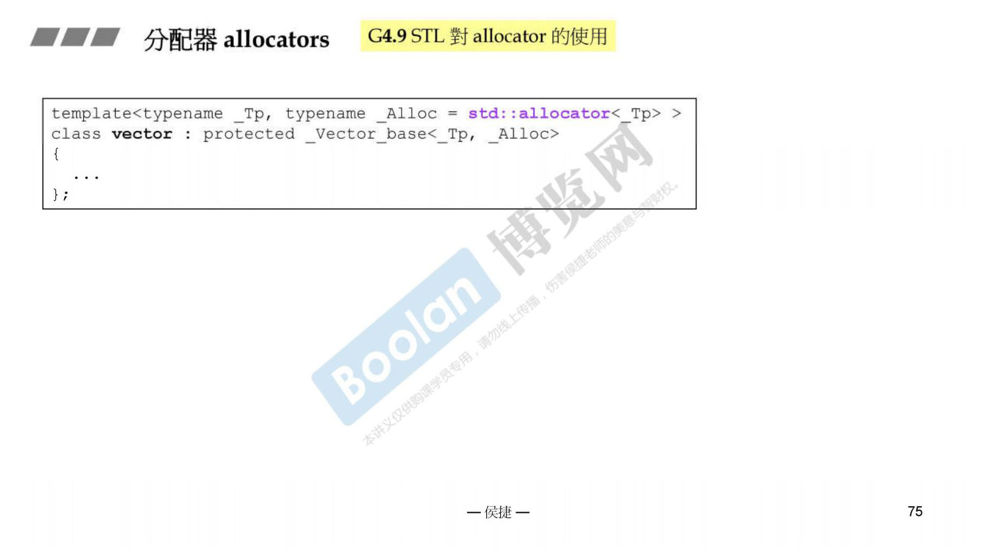
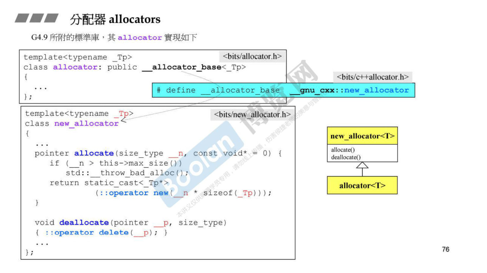
G4.9 STL 要使用之前的内存池，需要使用 __pool_alloc 。
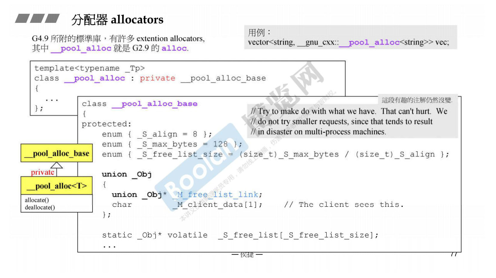