## 1.容器 deque 如何模拟连续空间
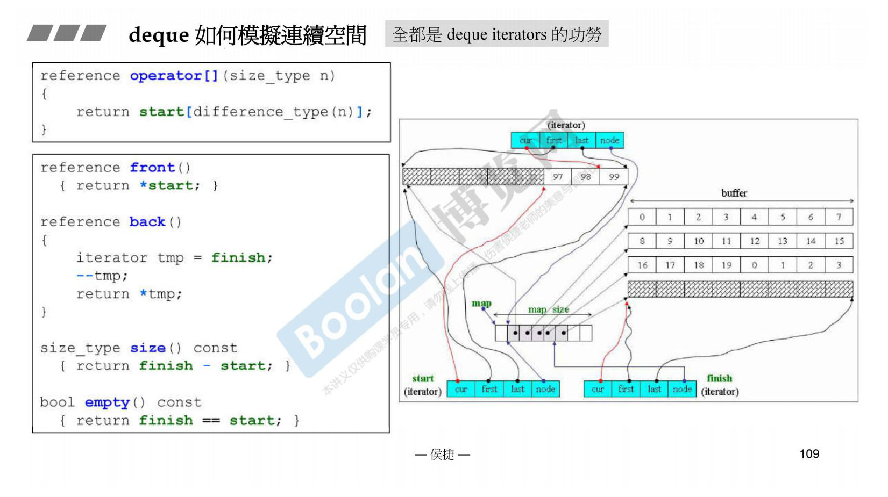
这里讲的很清楚。

后++ 都是用前++ 来实现的；同样的 -- 也是一样。node 存放在连续区域内（vector）可以直接加或减来跳转缓冲区。
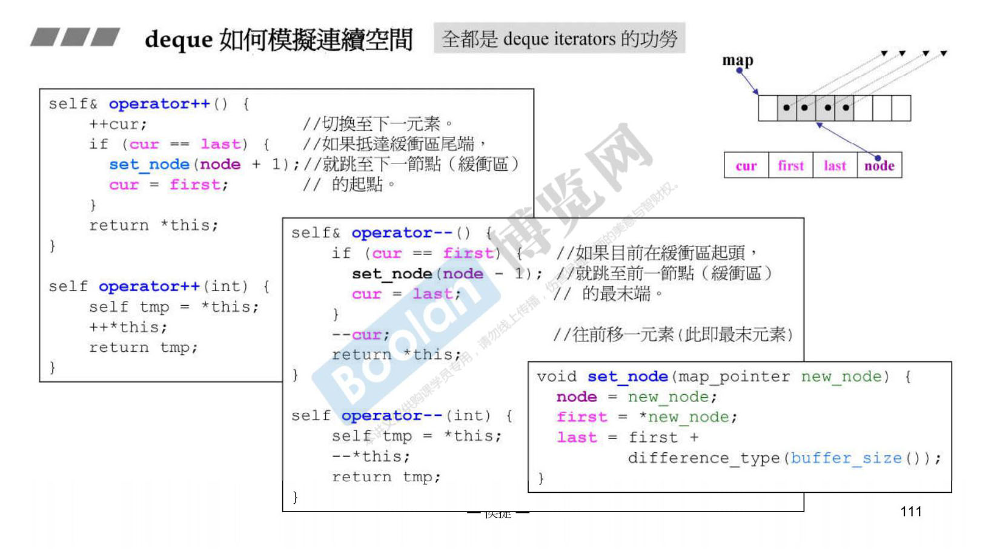
+= 需要先判断是否在同一缓冲区内。
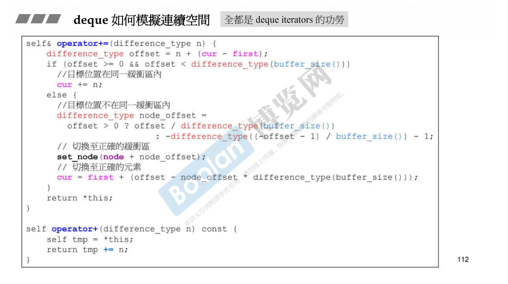
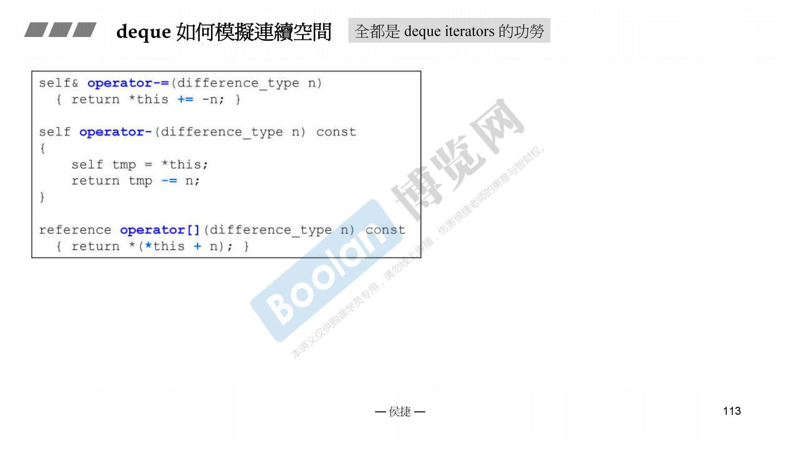
  
## 2.容器 deque G4.9实现
G4.9实现的容器都是类似的。
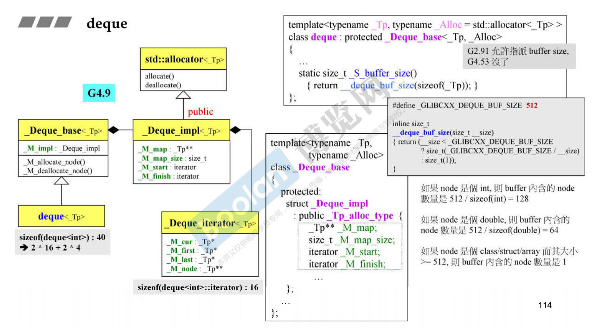
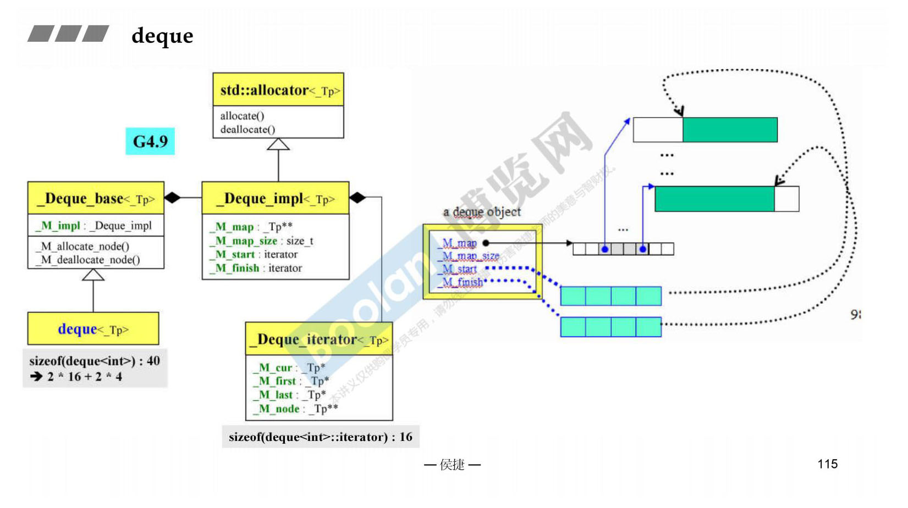
  
## 3.容器 queue
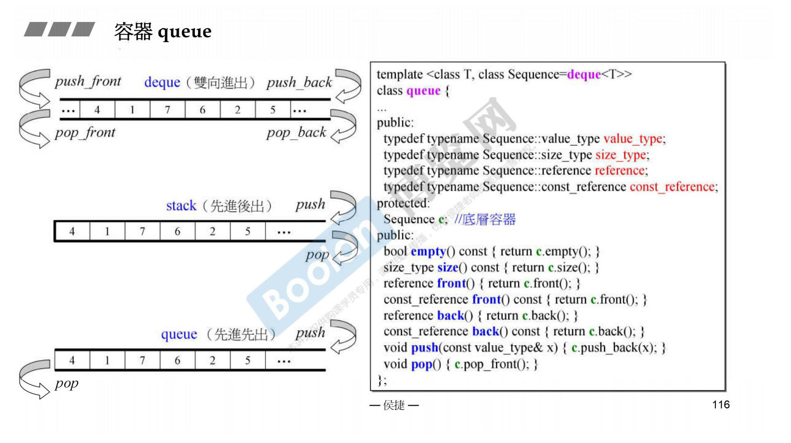
  
## 4.容器 stack
stack，栈，先进后出。
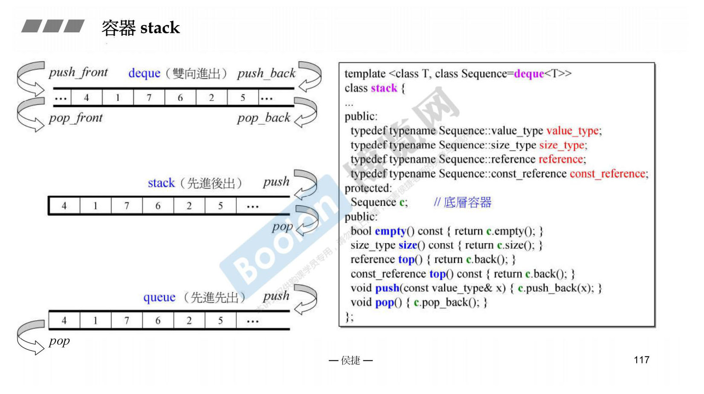
  
## 5.除了 deque 还有哪些容器可以作为底层容器
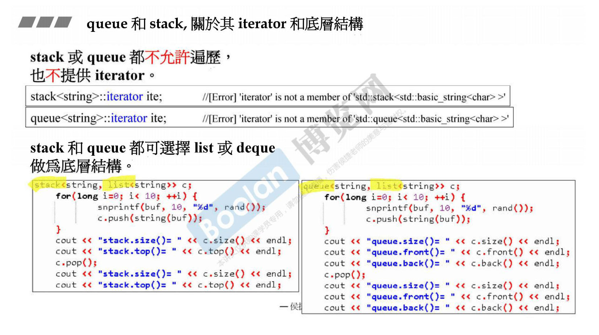
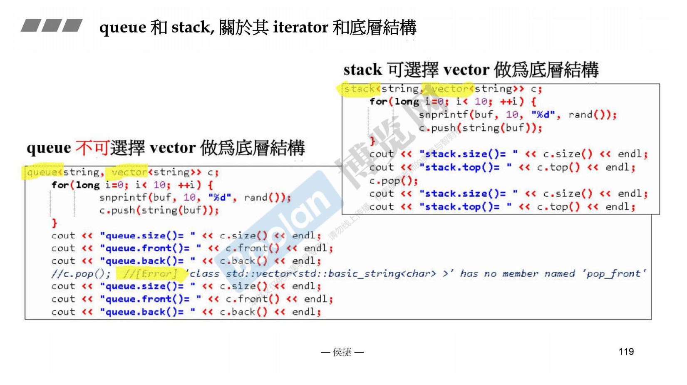
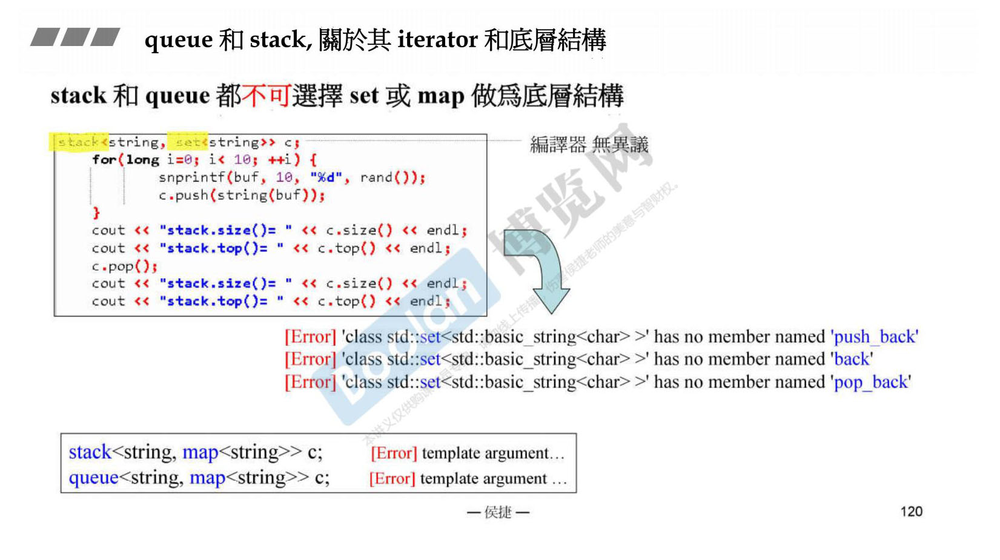
  