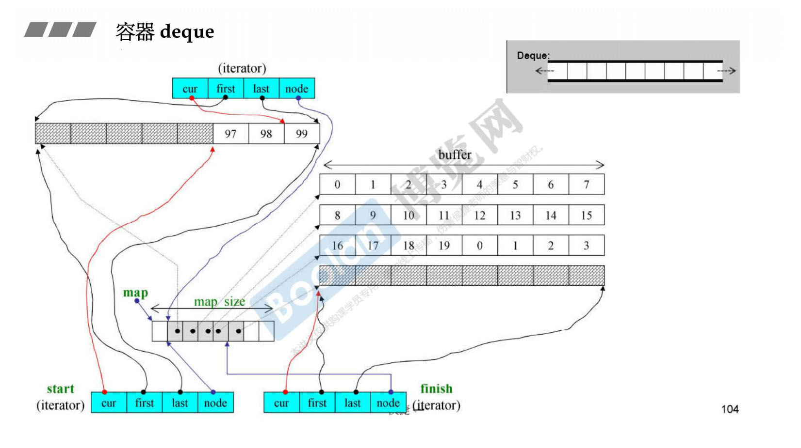
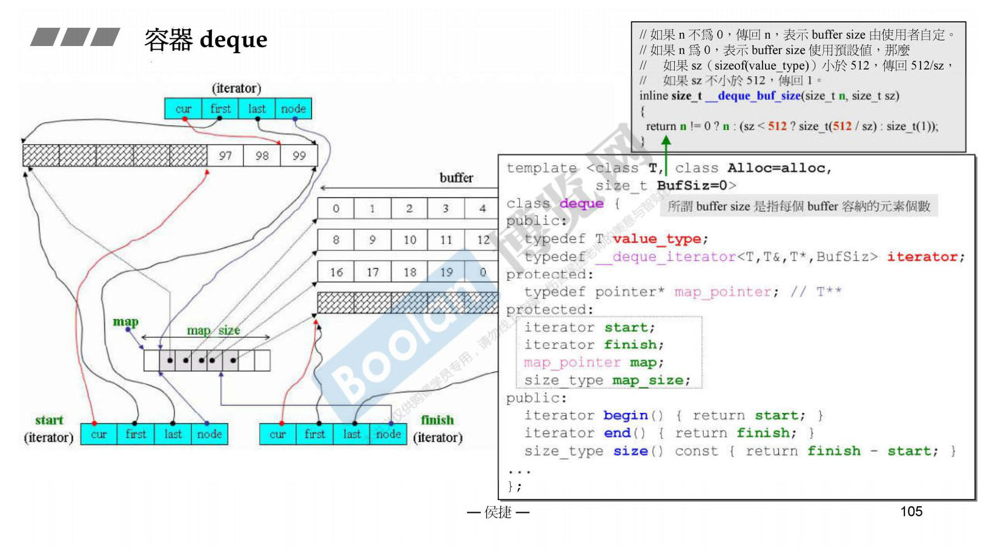
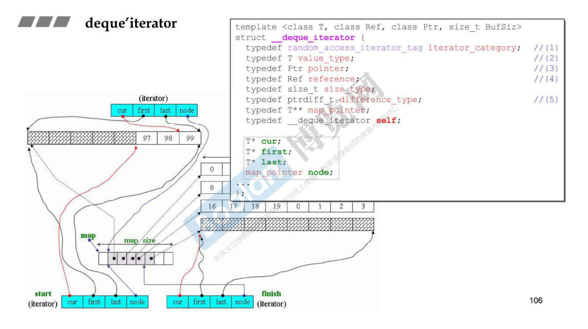
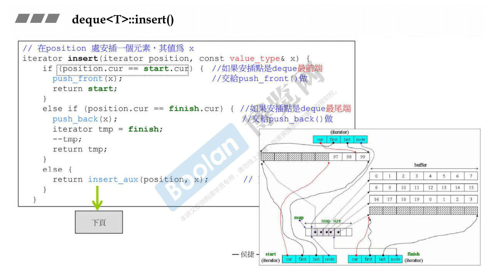
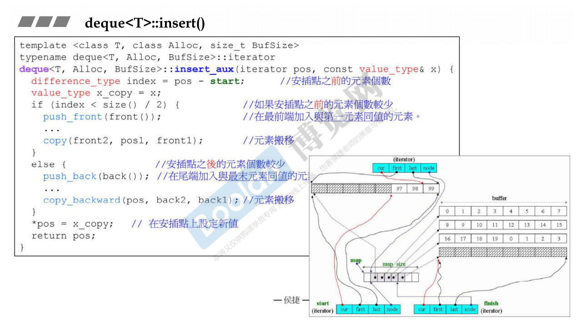

## 1.容器 deque
deque ，即**双端队列**（double ended queue），是一种可以在两端扩展或收缩的序列化容器。  
从图中可以看到 deque 是分段连续的，实质是分段的，连续只是假象。  
map（用 vector 实现） 是控制中心，存着每段 buffer（缓冲区）的指针。  
iterator 中有4个变量，cur 指向当前的位置，first 指向当前缓冲区的头，last 指向当前缓冲区的尾，node 指向控制中心对应位置。  

deque 也有4个变量，分别是 start 、 finish 、 map 和 map_size 。

  
## 2.容器 deque iterator
map_pointer 是指针的指针。

  
## 3.容器 deque insert
insert 实际操作前会先判断是挪头部分数据还是尾部分数据。

