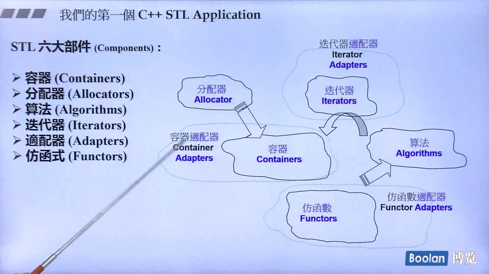
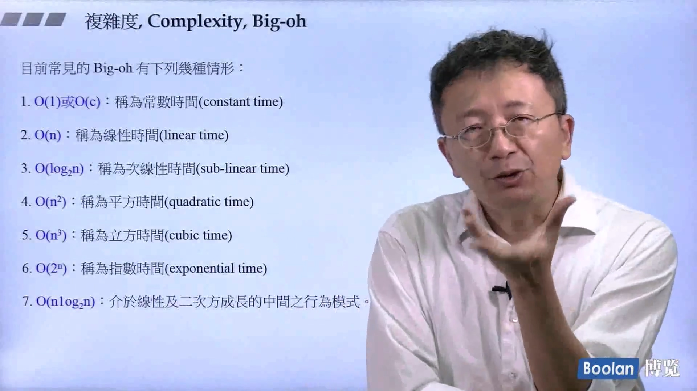

数据结构与算法，容器就是数据结构，算法 迭代器就是泛化指针
需要把东西放进容器，要给容器分配内存，就需要分配器
## 1.STL 六大部件介绍
之前说过，数据结构 + 算法 = 程序。容器就是数据结构，需要把东西放进容器以及给容器分配内存，这就需要分配器。迭代器就是泛化指针，算法作用于容器就是通过迭代器。仿函数顾名思义就是模仿函数。适配器有迭代器适配器、容器适配器和仿函数适配器，这里不细讲，下面程序中可以体会一下。

  
## 2.算法复杂度、“前闭后开”区间、范围 for 和 auto 关键字

