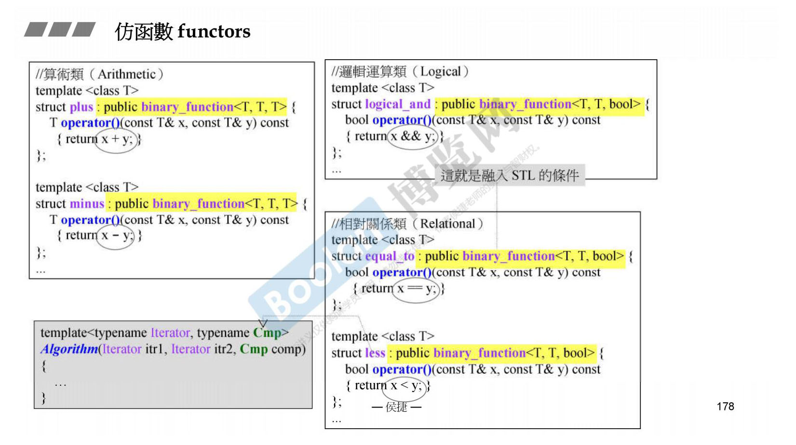
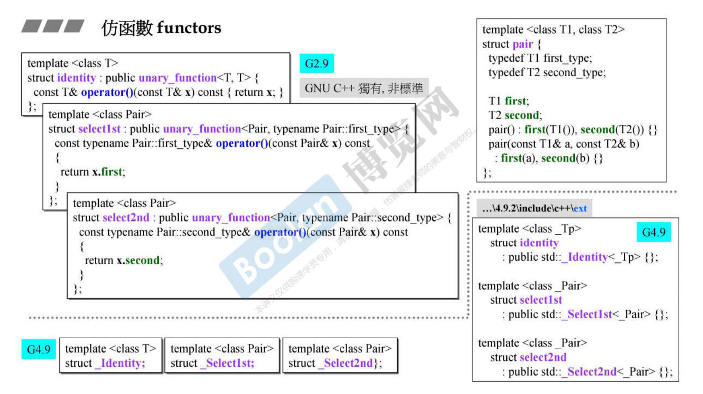
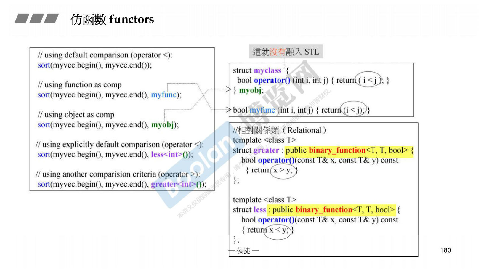
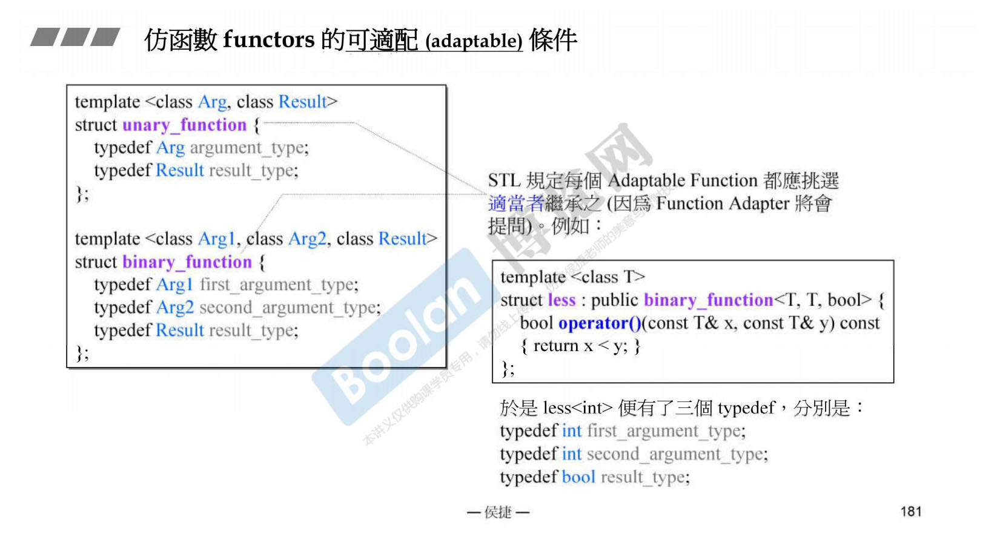

仿函数 functors，分为三种：算术类、逻辑运算类和相对关系类。STL 中的仿函数都会继承一个父类，这是融入 STL 的条件，后面再讲。

G2.9 和 G4.9 相比，这几个仿函数的名字变过了，不太好。

myfunc 是函数；myobj 是对象；less<int> 是类型，less<int> 是临时对象。
myclass 没有继承 binary_function 父类，这就没有融入 STL。

继承 unary_function 或 binary_function 父类，可以应对 Function Adapter 的提问，后续将学习适配器。
