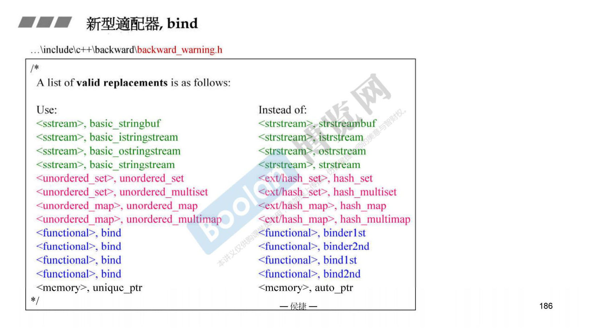
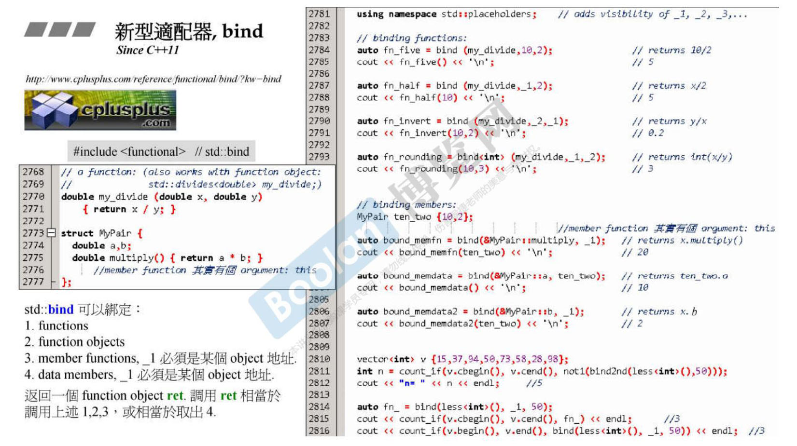

bind1st 和 bind2nd 都更新为 bind 。

1. 要使用占位符 _1 和 _2 需要使用 `using namespace std::placeholders;` ;
2. 使用 functions +不使用占位符；
3. 使用 functions +使用一个占位符；
4. 使用 functions +使用两个占位符，且占位符顺序对调；
5. 使用 functions +使用两个占位符，且指定返回为 int ；
6. 如果是 member functions 和 data members，第一占位必须是 object 地址；
7. 使用 function objects ，实现统计 vector 中大于等于50和小于50的个数。
